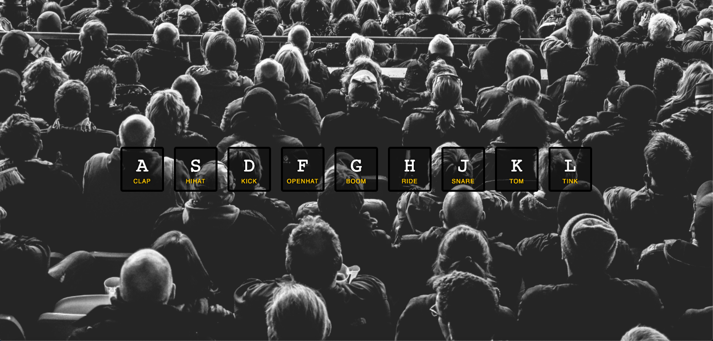

# Day 01 - JavaScript Drum Kit 

**Date:** 07/25/2021
**Status:** Completed

I got off to a good start! Completed two challenges in one day. It defintely helped that I started on a weekend. This first project was a bit tricky for me at first because I had never used the HTML audio elements and never really seen the `<kbd>` and `data-` attributes in action. Infact, it was my first time seeing the `data-` attribute.

# The Process

I watched a bit of the video then got confused about the `data-` attribute and `<kbd>` tag. I checked MDN and read up a bit on them, and tested them in a test HTML page I created for testing purposes.

Once I understood what was going on with the HTML, I proceeded to complete the video. Then I tried to recreate the project on my own. I got stuck a couple of times because I wanted to try other approaches but at the end of the day, I got back to writing the code similiar to the tutorial video with just few adjustments.

## About the adjustments I made

I made it more responsive by including media queries. Also, instead of calling  a `removeTransition` function, I added the event listener and forEach method right inside the `playAudio` function. I tried adding the event listener which calls the playSound function, on the `
` container holding the keys but I kept encountering some errors.

**Might add** 

Make it a clickable application so it can be played with a pointing device? Will this require another event listener added to the keys? Hmm! we'll see. Also, I would like to take another approach and re-write the code like adding the event listener to the keys parent element instead of the window object.

---

written by [@komecodes](https://github.com/komecodes).