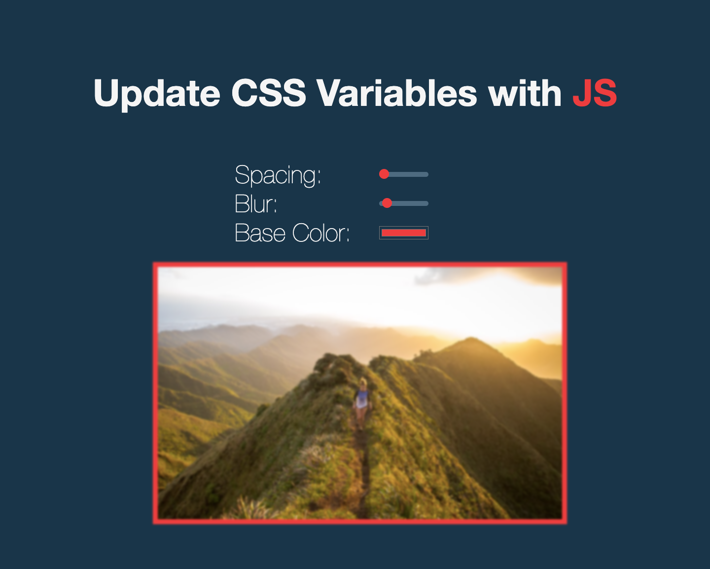

# Day 03 - Update CSS Variables with Javascript

**Date:** 09/11/2021
**Status:** Completed

## The Process

I watched the tutorial video and then attempted to recreate on my own as usual. This was pretty easy to create. I already knew how to create and use CSS Variables but I hardly used them before now. With this project, I have now learnt how to select and update CSS Variables with Javascript. Also learned how to style HTML range input elements with CSS.

## About the adjustments I made

I changed the default base color, made it responsive by using a div container to wrap the elements and adding a media query so that the font size is reduced on smaller screens. I also styled the range input elements and made the background color of the thumb change with the base color.

## Might add

I won't be adding anything.

---

written by [@komecodes](https://github.com/komecodes).
