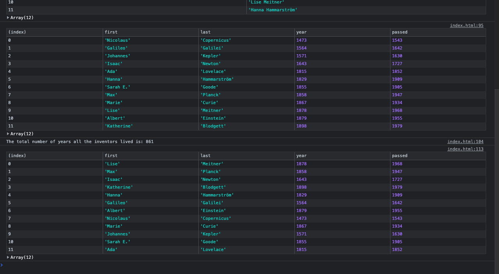

# Day 04 - Array Cardio Day 1

**Date:** 09/12/2021
**Status:** Completed

## The Process

I watched the tutorial video once and proceeded to do it on my own, as usual. I really enjoyed doing this one because now, I am less scared of these Array methods. It does save a lot of time.

## About the adjustments I made

Didn't make any adjustments unless wrote shorter code in some parts.

## Might add

I won't be adding anything. I will continue practicing these methods so that I can get even more comfortable with them.

---

written by [@komecodes](https://github.com/komecodes).
