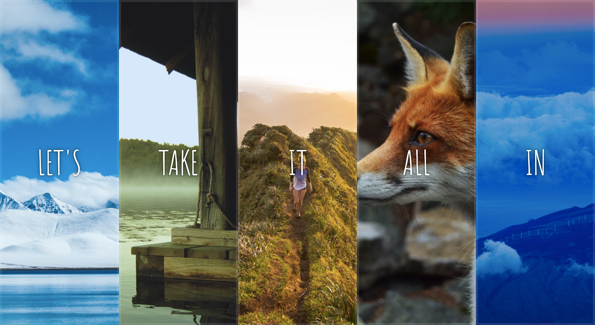

# Day 05 - Flex Panel Gallery

**Date:** 09/17/2021
**Status:** Completed

## The Process

I love this project. It is so fun to create and pretty! Making it responsive was even more fun. Maybe I just really like simple, pretty things and CSS transform property. I'd really love to master it so I can do many cool stuff too. Look, that cubic beizer thing! *(How is this pronounced? hayyy God! 🙆🏾‍♀️ )*  It is magic, please. How does one become a master of using such features?  

Anyhoo! This project is my one of my favs so far. It was a good reminder of the beauty that is CSS 🙇🏾‍♀️ . This is also my first time feeling comfortable with flexbox because it reminded me of what "flex: 1;" actually does, Haha! I never seem to remember that it existed so I've been sticking to CSS Grids, until now. I also don't know when I'll remind which of the justifys* is for which. Is it justify-content or items. I always have to google this 😭  or just keep trying all until one works 🥴 .  

For this project, I followed the usual process by watching the video once then replicating it. It was going smoothly until I was stuck for some hours trying to figure out why the transformed paragraphs stopped falling into place after I added the transitionend event listener. Then, it occurred to me to change the e.propertyName to event.propertyName. Ok, I googled it first, but yeah. This going to google why using "e" works sometimes but some other times, it doesnt.  

## About the adjustments I made

Made it responsive on smaller screens and changed transformY to transformX. It looks cool.

## Might add

I thought of styling the scrollbar to a dark-gradient-ish beauty, but I wanted to push this before today ends. We'll see!🤞🏾 .  

---

written by [@komecodes](https://github.com/komecodes).
